<!--
  GitHub Profile README for kaiwenyao
  Theme: tokyonight
  
  Stats cards are generated by GitHub Actions into profile/*.svg. To include private repositories,
  add README_STATS_PAT (classic token with repo + read:user) under Settings → Secrets → Actions.
  After the first push, manually run the "Update README stats cards" workflow once.
  Docs: https://github.com/anuraghazra/github-readme-stats#deploy-on-your-own
  
  Customization:
  - Edit the readme-typing-svg lines parameter; separate lines with semicolons.
  - Change theme=tokyonight to dark / radical / dracula, etc.
  - Add or remove badges by editing [![][badge-xxx]][xxx-url] entries.
  - Badge reference: https://shields.io/badges
-->

<!-- 
  Stats cards are rendered from static SVG files in this repository.
  See .github/workflows/readme-stats.yml.
  • Scheduled daily at 03:00 UTC, or manually via "Update README stats cards".
  • Private repository stats require README_STATS_PAT (classic: repo + read:user).
-->

  
  &nbsp;
  

  

<!-- 

  

 -->

  <picture>
    <source media="(prefers-color-scheme: dark)" srcset="https://raw.githubusercontent.com/kaiwenyao/kaiwenyao/output/github-snake-dark.svg" />
    <source media="(prefers-color-scheme: light)" srcset="https://raw.githubusercontent.com/kaiwenyao/kaiwenyao/output/github-snake.svg" />
    
  </picture>

  

---

### 🚀 About Me

> MSc Computer Science student at University College Dublin with an engineering background and a focus on software development. I enjoy turning complex requirements into reliable APIs, data flows, and maintainable product systems.

- 🖥️ **Backend & full-stack development**: Java / Spring Boot, Go / Gin, Python / FastAPI, React / TypeScript across production-style projects
- 🗄️ **Data & service design**: MySQL, PostgreSQL, Redis, JPA, MyBatis Plus, and SQLAlchemy, with attention to API boundaries, data models, and maintainability
- 🔐 **Authentication & security**: JWT access/refresh flows, token-version logout invalidation, Redis token blacklisting, SMS/email verification, and BCrypt
- 🤖 **AI & data products**: LangChain + DeepSeek, SSE streaming, scikit-learn prediction services, real-time data ingestion, and visualization
- 🐳 **Delivery & automation**: Jenkins, Docker, nginx, and Alibaba Cloud Yunxiao for build, test, image, and deployment pipelines
- 🧪 **Engineering quality**: unit tests, integration tests, testcontainers-go, Flyway/Alembic migrations, and systems that are easier to verify and evolve

---

### 🛠 Tech Stack

#### 🖥️ Frontend

[![][badge-react]][react-url]
[![][badge-vue]][vue-url]
[![][badge-typescript]][typescript-url]
[![][badge-tailwind]][tailwind-url]

#### ⚙️ Backend

[![][badge-java]][java-url]
[![][badge-spring]][spring-url]
[![][badge-python]][python-url]
[![][badge-go]][go-url]

#### 🚀 DevOps & CI/CD

[![][badge-jenkins]][jenkins-url]
[![][badge-docker]][docker-url]
[![][badge-mysql]][mysql-url]
[![][badge-postgresql]][postgresql-url]
[![][badge-redis]][redis-url]

#### 🛠️ Tools & Collaboration

[![][badge-git]][git-url]
[![][badge-github]][github-url]

---

<!-- ==================== Badge Reference Definitions ==================== -->
<!-- Reference-style links keep the body tidy; edit this section to update badges globally. -->

[badge-react]: https://img.shields.io/badge/React-61DAFB?style=for-the-badge&logo=react&logoColor=black
[react-url]: https://react.dev

[badge-vue]: https://img.shields.io/badge/Vue.js-4FC08D?style=for-the-badge&logo=vuedotjs&logoColor=white
[vue-url]: https://vuejs.org

[badge-typescript]: https://img.shields.io/badge/TypeScript-3178C6?style=for-the-badge&logo=typescript&logoColor=white
[typescript-url]: https://www.typescriptlang.org

[badge-tailwind]: https://img.shields.io/badge/Tailwind%20CSS-06B6D4?style=for-the-badge&logo=tailwindcss&logoColor=white
[tailwind-url]: https://tailwindcss.com

[badge-java]: https://img.shields.io/badge/Java-ED8B00?style=for-the-badge&logo=openjdk&logoColor=white
[java-url]: https://www.java.com

[badge-spring]: https://img.shields.io/badge/Spring%20Boot-6DB33F?style=for-the-badge&logo=springboot&logoColor=white
[spring-url]: https://spring.io/projects/spring-boot

[badge-python]: https://img.shields.io/badge/Python-3776AB?style=for-the-badge&logo=python&logoColor=white
[python-url]: https://www.python.org

[badge-go]: https://img.shields.io/badge/Go-00ADD8?style=for-the-badge&logo=go&logoColor=white
[go-url]: https://go.dev

[badge-jenkins]: https://img.shields.io/badge/Jenkins-D33833?style=for-the-badge&logo=jenkins&logoColor=white
[jenkins-url]: https://www.jenkins.io

[badge-docker]: https://img.shields.io/badge/Docker-2496ED?style=for-the-badge&logo=docker&logoColor=white
[docker-url]: https://www.docker.com

[badge-mybatis]: https://img.shields.io/badge/MyBatis%20Plus-FF6B6B?style=for-the-badge&logo=mybatis&logoColor=white
[mybatis-url]: https://baomidou.com

[badge-mysql]: https://img.shields.io/badge/MySQL-4479A1?style=for-the-badge&logo=mysql&logoColor=white
[mysql-url]: https://www.mysql.com

[badge-postgresql]: https://img.shields.io/badge/PostgreSQL-4169E1?style=for-the-badge&logo=postgresql&logoColor=white
[postgresql-url]: https://www.postgresql.org

[badge-redis]: https://img.shields.io/badge/Redis-FF4438?style=for-the-badge&logo=redis&logoColor=white
[redis-url]: https://redis.io

[badge-cpp]: https://img.shields.io/badge/C++-00599C?style=for-the-badge&logo=c%2B%2B&logoColor=white
[cpp-url]: https://isocpp.org

[badge-git]: https://img.shields.io/badge/Git-F05032?style=for-the-badge&logo=git&logoColor=white
[git-url]: https://git-scm.com

[badge-github]: https://img.shields.io/badge/GitHub-181717?style=for-the-badge&logo=github&logoColor=white
[github-url]: https://github.com

[badge-gitlab]: https://img.shields.io/badge/GitLab-FC6D26?style=for-the-badge&logo=gitlab&logoColor=white
[gitlab-url]: https://gitlab.com

[badge-homepage]: https://img.shields.io/badge/Homepage-181717?style=for-the-badge&logo=github&logoColor=white
[github-profile]: https://github.com/kaiwenyao
